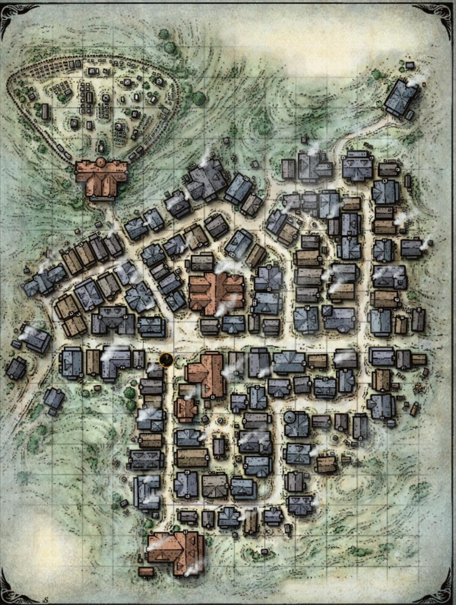

# Деревня Баровия

Деревня (или город) расположен на самом востоке долины [Баровия](./barovia_land.md).

Самое первое место в которое попал отряд приключенцев после того как прошел через туман [Страда](../npcs/strad.md).

Был атакован силами [Страда](../npcs/strad.md) после того как экспедиция во главе с [Дору](../npcs/doru.md) потерпела неудачу в убийстве главного вампира.

После нескольких бессоных ночей сопровождаемых тяжелейшими боями, [Страд](../npcs/strad.md) объявил о прекращении атак. Последней жертвой стал [Колян](../npcs/kolyan.md) который был убит самим [Страдом](../npcs/strad.md) а может быть и кем-то из его прислужников. В то же время [Ирина](../npcs/irina.md) была укушена.

## Жители
- [Колян](./kolyan) *мертв*
- [Исмарк](./ismark_kolyanych)
- [Ирина](./irina)
- [Бильдрад](./bildrad)
- [Парвимпл](./parvimpl.md)
- [Дору](./doru.md)
- [Донович](./donovich.md)